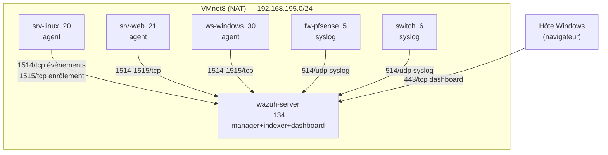

# Architecture réseau — VMs VMware Workstation

## Réseau virtuel

Toutes les VMs sont sur **VMnet8 (NAT)** : elles communiquent entre elles, ont accès à Internet, et l'hôte Windows peut joindre le dashboard.

> Vérifier le subnet réel : VMware → `Edit > Virtual Network Editor` → VMnet8 → *Subnet IP*.
> Le plan ci-dessous suppose `192.168.195.0/24` — **adapter si votre VMnet8 diffère** (souvent `192.168.x.0/24` aléatoire).
> Les IP statiques sont idéalement **hors de la plage DHCP** de VMnet8 (par défaut .128–.254).
> ⚠️ Le serveur est en `.134` (dans la plage DHCP) : vérifier dans le Virtual Network Editor qu'aucune autre VM ne reçoit cette IP, ou réduire la plage DHCP (ex: .150–.254).
> `.1` = hôte Windows (carte VMnet8), `.2` = passerelle NAT VMware → **ne pas attribuer ces IP**.

## Plan d'adressage

| VM | OS | IP | Rôle | Phase |
|---|---|---|---|---|
| `wazuh-server` | Ubuntu 24.04 | **192.168.195.134** | SIEM all-in-one (manager + indexer + dashboard) | 1 |
| `srv-linux` | Ubuntu/Debian | 192.168.195.20 | Serveur Linux monitoré (agent) | 1 |
| `srv-web` | Ubuntu + Apache/Nginx | 192.168.195.21 | Serveur web monitoré (agent) | 1 |
| `ws-windows` | Windows 10/11 | 192.168.195.30 | Poste de travail monitoré (agent) | 1 |
| `fw-pfsense` | pfSense | 192.168.195.5 | Firewall → syslog | 1 |
| switch (GNS3/réel) | — | 192.168.195.6 | Switch → syslog | 1 |
| `wazuh-indexer` | Ubuntu 24.04 | 192.168.195.11 | Nœud indexation dédié | 2 |
| `wazuh-dashboard` | Ubuntu 24.04 | 192.168.195.12 | Nœud visualisation dédié | 2 |

Astuce ressources limitées : le **poste Windows monitoré peut être l'hôte VMware lui-même** (l'hôte a une carte VMnet8 et joint le serveur Wazuh directement).

## Diagramme

## Matrice de flux

| Source | Destination | Port/Proto | Usage |
|---|---|---|---|
| Agents | wazuh-server | 1514/tcp | Envoi des événements |
| Agents | wazuh-server | 1515/tcp | Enrôlement (une fois) |
| Firewall, switch | wazuh-server | 514/udp | Syslog agentless |
| Hôte / admin | wazuh-server | 443/tcp | Dashboard web |
| Admin / API | wazuh-server | 55000/tcp | API Wazuh |
| Dashboard/Filebeat | indexer | 9200/tcp | Indexation/requêtes (interne en phase 1) |
| Nœuds cluster | manager | 1516/tcp | Cluster Wazuh (phase 2+) |

## Ressources VM serveur Wazuh (phase 1)

| Ressource | Minimum | Recommandé |
|---|---|---|
| vCPU | 4 | 4–8 |
| RAM | 8 Go | 8–16 Go |
| Disque | 50 Go | 10